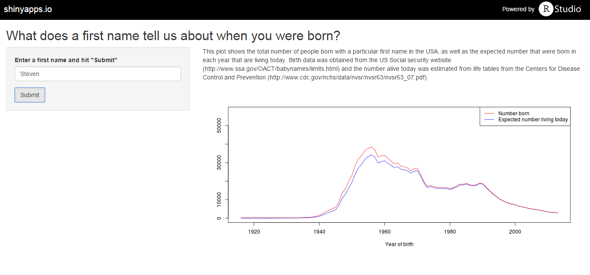

## What's in a name?

<span style="font-size:1em;">
Most first names tend not to stand the test of time. Combining a person's name with knowledge of how long a person typically lives gives us enough information to compute the distribution of how old a person is based on their first name.</span>  
  
    
*Check out the Shiny app* [here](https://sc1463.shinyapps.io/names_likelihood) 

---
## Why do we care?
This could be useful for any type of service that uses a recommendation algorithm to target customers that have given their name. For example, if you sign up for Netflix, it could use knowledge of the distribution of your age to provide better recommendations.

---
## what does the app do?
   
Takes in a name and outputs the number born and expected number still living over time. Check out the live version [here](https://sc1463.shinyapps.io/names_likelihood) and the source code [here](https://github.com/stephcarew/names)

---
## It's also pretty fun
Let's try the name **Whitney**  
```{r slidify, echo=FALSE, results = "asis",fig.width = 6, fig.height = 4}
library(shiny)

full_data <- read.csv("full_data.csv")
survival_prob <- read.csv("all_LT.csv")
#sort the survival probablitity descending by year
survival_prob <- apply(survival_prob, 2, rev)
years = 1916:2013

#return the data needed to make the plot
    data_for_name <- full_data[full_data$name == "Whitney", 2:99]
    data_for_name <- as.data.frame(t(data_for_name))
    names(data_for_name) <- "total_born"
    data_for_name$exp_number_living <- data_for_name$total_born *survival_prob[,2]

    
    plot(years, data_for_name$exp_number_living, type = "l", col = "blue", xlab = "Year of birth", ylab= "",ylim = range(0:max(data_for_name$total_born)*1.5))
    par(new=T)
    plot(years, data_for_name$total_born, type = "l", col = "red", axes = F, ylim = range(0:max(data_for_name$total_born)*1.5), xlab = "", ylab = "")
    par(new=T)
  legend("topright", c("Number born","Expected number living today"),lty=c(1,1),lwd=c(1,1),col=c("red","blue"))

  

```  
  
  
*Think she had an effect?*

---
## References
* The data for the number of births per year in the US came from the [Social Security Website](http://www.ssa.gov/OACT/babynames/limits.html)
* The data for survival probability came from the [Centers for Disease Control and Prevention](http://www.cdc.gov/nchs/data/nvsr/nvsr63/nvsr63_07.pdf)

